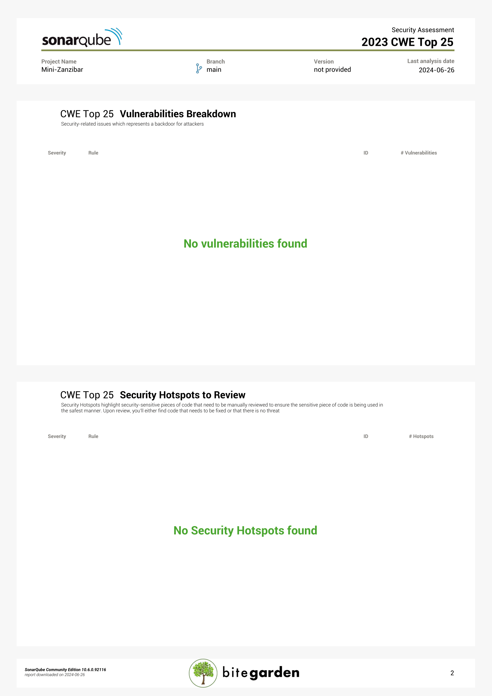

# Pregled koda autorizacionog servera Mini-Zanzibar

## Opis projekta
Ovaj projekat je implementacija mini verzije Zanzibara, globalnog sistema autorizacije, koji omogućava fleksibilno definisanje i evaluaciju politika kontrole pristupa. Naš cilj je podržati skalabilnu i konzistentnu autentifikaciju, minimizirati kašnjenje i osigurati visoku dostupnost za provere autorizacije. Implementiramo relacijske torke za skladištenje ACL-ova pomoću Google-ovog LEVEL DB i koristimo ConsulDB za konfiguraciju namespace-a. Definišemo različite tipove pristupa poput owner, editor, viewer i pravila za izračunavanje relacija između korisnika i objekata.

Osim toga, implementiramo API za upravljanje ACL-ovima i namespace-ovima, osmišljavamo celovit sistem koji koristi mini Zanzibar kao deo većeg rešenja. Važno nam je pratiti bezbednosne zahteve i modele pretnji, kao i vršiti redovne code review-e i statičku analizu koda radi osiguranja bezbednosti našeg softvera.

## Lista članova tima
- Bojan Mijanović SV8/2020
- Vukašin Bogdanović SV9/2020
- Jovan Jokić SV47/2020

## Opis pronađenih defekata
Tokom prvobitnog ručnog pregleda koda, sproveli smo sitne optimizacije i refaktorizacije radi poboljšanja čitljivosti i održivosti koda. Ovaj pregled nije otkrio ozbiljne sigurnosne pretnje. Međutim, nakon detaljnog skeniranja koda pomoću SonarQube platforme, identifikovali smo 5 problema u održavanju koda i 2 sigurnosna hotspota koji zahtevaju našu pažnju.

### Problemi održavanja (5)
Problemi održavanja obuhvataju aspekte kao što su kompleksnost funkcija, nedostatak komentara u kodu koji bi olakšali razumevanje, kao i potencijalno neefikasne ili redundante delove koda. Ovi faktori mogu otežati buduće promene i proširenja sistema, što je ključno za održavanje dugoročne funkcionalnosti i skalabilnosti softvera. Važno je adresirati ove probleme kroz refaktorizaciju i bolje dokumentovanje kako bi se olakšalo održavanje i dalji razvoj sistema.

Identifikovani problemi uključuju upotrebu rezervisanih reči programskog jezika u nazivima promenljivih, nepotrebne importe modula i biblioteka, kao i deklaraciju promenljivih koje se ne koriste u kodu. Ovi problemi mogu doprineti nejasnoći i suvišnom opterećenju u kodu, otežavajući njegovo održavanje i razumevanje. Važno je eliminisati ove nedostatke kroz preciznije nazivanje promenljivih, optimizaciju importa i uklanjanje nepotrebnih deklaracija kako bi se poboljšala čitljivost i efikasnost koda.

### Sigurnosni Hotspot (2)
Sigurnosni hotspotevi ukazuju na delove koda gde postoji potencijalna ranjivost ili nedostatak adekvatne zaštite. Ovi problemi mogu uključivati nedovoljnu validaciju korisničkih ulaznih podataka, potencijalne XSS ili SQL injection napade, ili nedostatak autorizacije prilikom pristupa osetljivim resursima. Rešavanje ovih hotspoteva je ključno za osiguranje integriteta i bezbednosti aplikacije, što obuhvata implementaciju odgovarajućih mehanizama validacije, sanitizacije ulaznih podataka i autorizacije, u skladu sa najboljim praksama za razvoj sigurnih softverskih rešenja

U našem softveru, oba identifikovana sigurnosna hotspota odnose se na upotrebu HTTP protokola umesto HTTPS, što može predstavljati sigurnosni rizik zbog nedostatka enkripcije podataka. Ovo je važno adresirati jer HTTPS pruža sigurniju komunikaciju između klijenta i servera, štiteći podatke od potencijalnih napada kao što su presretanje podataka ili manipulacija saobraćaja. Implementacija HTTPS-a je standardna praksa za osiguranje integriteta i zaštite privatnosti podataka u modernim web aplikacijama.

## Dodatne bezbednose provere
U našem procesu sigurnosne analize koda, takođe smo koristili Security plugin od kompanije Bitegarden. Ovaj plugin je specijalizovan za testiranje softvera prema standardima kao što su CWE, ISO5055, OWASP Top 10 i OWASP Application Security Verification Standard (ASVS). Korišćenjem ovog alata, detaljno smo proverili naš kod kako bismo identifikovali potencijalne ranjivosti i osigurali da naše rešenje ispunjava visoke standarde bezbednosti prema industrijskim praksama. Integracija ovog alata je ključna za osiguranje robustnosti i sigurnosti našeg softvera protiv širokog spektra poznatih sigurnosnih pretnji.

### CWE

#### Svi zahtevi CWE standarda su ispunjeni

### ISO 5055

#### Svi zahtevi ISO 5055 standarda su ispunjeni

### OWASP TOP 10

#### A2 Using clear-text protocols is security-sensitive
Kao što smo videli u poglavlju o sigurnosnim hotspotovima, identifikovali smo da upotreba nezaštićenih HTTP protokola umesto HTTPS-a predstavlja ozbiljan sigurnosni rizik za naš softver. Ova praksa direktno se kosi sa preporukama OWASP Top 10 standarda, koji naglašava važnost korišćenja sigurnih komunikacionih kanala radi zaštite integriteta i privatnosti podataka. Ovi hotspotovi zahtevaju našu pažnju i hitno rešavanje kako bismo osigurali da naše rešenje zadovoljava visoke standarde sigurnosti i zaštite podataka.

### OWASP ASVS

#### V1.9 Communications Architecture
- Zahtev: Verifikacija da aplikacija enkriptuje komunikaciju između komponenti, posebno kada su ove komponente u različitim kontejnerima, sistemima, lokacijama ili provajderima u oblaku.

- Problemi: Identifikovana su dva hotspot-a koji se odnose na ovaj zahtev (CWE 319). Ovaj segment je ocenjen kao A, što označava visok rizik.

- Komentar: Nedostatak enkripcije u komunikaciji između komponenti može izložiti podatke riziku od presretanja ili manipulacije. Implementacija TLS ili sličnih sigurnosnih protokola je ključna za zaštitu integriteta i privatnosti podataka u distribuiranim okruženjima.

#### V2.2 General Authenticator Security
- Zahtev: Verifikacija da je međusobno autentifikovani TLS implementiran između CSP (Credential Service Provider) i aplikacije koja vrši autentifikaciju.

- Problemi: Identifikovana su dva hotspot-a koji se odnose na ovaj zahtev (CWE 319). Segment je takođe ocenjen kao A.

- Komentar: Nedostatak međusobno autentifikovanog TLS-a između CSP-a i aplikacije može dovesti do situacija gde se neovlašćeni entiteti mogu lažno predstavljati kao verifikovani, što predstavlja ozbiljan sigurnosni rizik za autentifikaciju i kontrolu pristupa.

#### V8.3 Sensitive Private Data
- Zahtev: Verifikacija da osetljivi podaci nisu poslati serveru putem HTTP poruke ili u zaglavljima, te da parametri upita u bilo kojoj HTTP metodi ne sadrže osetljive podatke.

- Problemi: Identifikovana su dva hotspot-a koji se odnose na ovaj zahtev (CWE 319). Segment je ocenjen kao A.

- Komentar: Slanje osetljivih podataka putem neenkriptovanih poruka može omogućiti napadačima da presretnu ove podatke tokom komunikacije. Ovaj zahtev je ključan za zaštitu privatnosti i usaglašenost sa regulativama o zaštiti podataka poput GDPR-a.

#### V9.1 Client Communication Security
- Zahtev: Verifikacija da se TLS koristi za sve konekcije klijenta i da se ne koriste nesigurni ili neenkriptovani komunikacioni kanali.

- Problemi: Identifikovana su dva hotspot-a koji se odnose na ovaj zahtev (CWE 319). Segment je ocenjen kao A.

- Komentar: Nedostatak upotrebe TLS-a za sve konekcije klijenta može izložiti komunikaciju riziku od presretanja ili manipulacije podacima. Implementacija sigurnosnih protokola kao standarda za sve klijentske konekcije je ključna za očuvanje sigurnosti i integriteta podataka.

#### V9.2 Server Communication Security
- Zahtev: Verifikacija da se enkriptovana komunikacija poput TLS-a koristi za sve dolazne i odlazne konekcije, uključujući upravljačke portove, nadzor, autentifikaciju, API pozive, web servise, baze podataka, oblak, serverless arhitekture, mainframe sisteme, spoljne i partner konekcije.

- Problemi: Identifikovana su dva hotspot-a koji se odnose na ovaj zahtev (CWE 319). Segment je ocenjen kao A.

- Komentar: Nedostatak enkripcije u komunikaciji za različite vrste server-side konekcija može predstavljati značajan sigurnosni rizik, posebno u kontekstu izloženosti osetljivih podataka i održavanja integriteta sistema. Implementacija TLS-a za sve vrste konekcija je ključna za obezbeđivanje sigurnosti i usaglašenosti sa standardima bezbednosti.