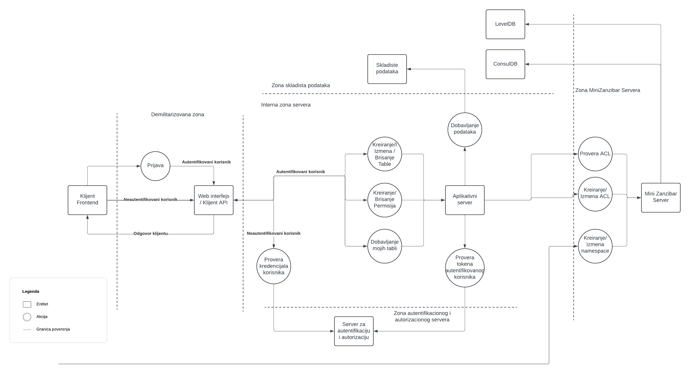

# THREAT MODEL

## Analiza Potencijalnih Napadača

### Konkurencija
- **Nivo veštine**: Visok
- **Pristup sistemu**: Indirektan, kroz industrijsku špijunažu ili koristeći insajderske informacije, plaćanjem eksternih hakera da izvrše napad, slanjem legalnih zahteva za informacije pod lažnim izgovorima
- **Ciljevi**: Dobijanje poslovne prednosti kroz krađu poverljivih podataka ili sabotiranje operacija, podmetanje problema kako bi se smanjila konkurentska prednost, industrijska spijunaža
- **Strategije**: Pravna zaštita i kontrola pristupa osetljivim informacijama, obuka zaposlenih o prepoznavanju i sprečavanju socijalnog inženjeringa kao i obezbeđivanje koninuirane zaštite protiv naprednih napada

### Ljudi koji ukazuju na greške za novac
- **Nivo veštine**: Različit, od amatera do profesionalaca
- **Pristup sistemu**: Direktan, kroz pronalaženje i iskorišćavanje sigurnosnih propusta u vidu javno poznatih ranjivosti, ekspolatacije loših sigurnosnih praksi..
- **Ciljevi**: Finansijska dobit kroz bug bounty programe ili ucenjivanje kompanije, prikupljanje priznanja i reputacije u hakerskoj zajednici
- **Strategije**: Redovno skeniranje sistema na ranjivosti, primena najboljih sigurnostnih praksi, edukacija tima o najnovijim sigurnosim trendovima i pretnjama

### Nezadovoljni zaposleni ili bivši zaposleni
- **Nivo veštine**: Varijabilan
- **Pristup sistemu**: Pristup poveljivim informacijama zbog pozicije unutar organizacije, korišćenje već poznatih slabosti sistema, zloupotreba administrativnih privilegija
- **Ciljevi**: Lična osveta ili finansijska dobit
- **Strategije**: Primena principa najmanjih privilegija, detaljno logovanje i monitoring aktivnosti korisnika, periodične sigurnosne provere zaposlenih

### Testeri plaćeni od strane kompanije
- **Nivo veštine**: Profesionalan
- **Pristup sistemu**: Direktan, sa dozvolom kompanije. Pristup informacijama o arhitekturi dizajnu i implementaciji sistema, korišćenje naprednih alata
- **Ciljevi**: Identifikacija i ispravljanje sigurnosnih propusta pre nego što ih iskoriste zlonamerni napadači, zadovoljavanje regulatornih i internih bezbedonosnih standarda
- **Strategija**: Black, White i Gray Box testovi, automatizovani i ručni testovi

## Analiza Osetljive Imovine

1. **Baza podataka klijentske aplikacije**
   - **Izloženost**: Pristup imaju zaposleni, IT odeljenje, i potencijalno treće strane poput klijenata.
   - **Bezbednosni ciljevi**: Visoka poverljivost ličnih podataka, integritet informacija o rezervacijama, i dostupnost za ažuriranje i pristup u realnom vremenu.
   - **Uticaj**: Kompromitacija ovih ciljeva može dovesti do finansijskih gubitaka, gubitka poverenja klijenata, i pravnih posledica.

2. **Interni komunikacioni sistemi**
   - **Izloženost**: Pristup imaju svi zaposleni, sa posebnim nivoima pristupa za različita odeljenja.
   - **Bezbednosni ciljevi**: Poverljivost korporativnih komunikacija, integritet prenetih podataka, i stalna dostupnost sistema.
   - **Uticaj**: Napadi mogu uzrokovati poremećaj operacija, curenje osetljivih informacija, i štetu reputaciji kompanije.

3. **Web platforma za klijente**
   - **Izloženost**: Javno dostupna.
   - **Bezbednosni ciljevi**: Poverljivost korisničkih naloga, integritet web sadržaja i funkcionalnosti, dostupnost usluga 24/7.
   - **Uticaj**: Hakerski napadi mogu dovesti do gubitka poverenja klijenata, pravnih sankcija zbog kršenja propisa o zaštiti podataka, i povrede reputacije.
     
4. **Mini zanzibar (ACLs & Namespace Configuration)**
   - **Izloženost**: Javno dostupna putem API poziva
   - **Bezbedonosni ciljevi**:
      - Poverljivost: Osigurati da samo ovlašćeni korisnici mogu pristupiti ACL-ovima ili namespace konfiguraciji
      - Integritet: Osigurati na ACL i Namespace nisu menjani na neovlašćen način
      - Dostupnost: Osigurati pravilno funkcionisanje sistema u svakom trenutku
    - **UticajRanjivosti** 
      - Može dovesti do curenja informacija o korisnicima i njihovim pravima, manipulacije podacima u svrhu neovlašćenog pristupa zaštićenim resursima i onemogućavanja autorizacionih odluka što može dovesti do prekida u radu aplikacije

## Površina Napada

### Mini Zanzibar
Korisnici nemaju direktan pristup ovom servisu, shodno tome on nije otvoren za zahteve sa interneta. Jedini mogući pristup korisnika Mini zanzibar servisu moguć je kroz klijentski API. 

API
   - Konfiguracije namespace-a
   - Ažuriranje ACL-a
   - Upit ka ACL-u

Podaci
   - ConsulDB
   - LevelDB

### Klijentska aplikacija
Korisnici imaju direktan pristup putem web aplikacije

API
   - Prijava
   - Registracija
   - Dobavaljanje korisnika
   - Dobavljanje dokumenta
   - Dobavljanje mojih/deljenih dokumenata
   - Kreiranje novog dokumenta
   - Izmena dokumenta
   - Deljenje dokumenta
   - Ukidanje deljenja dokumenta
   - Provera permisija dokumenta
   - Brisanje dokumenta
Podaci
   - Postgre SQL 
     - o korisnicima
     - o dokumentima

## Diagram toka podataka

## Analiza pretnji i mitigacije

### Spoofing (Lažiranje identiteta)
- **Pretnja** 
  - Napadač može da koristi neku vrstu spoofing napada, npr. Email spoofing unutar koga se sadrži link koji može da navede korisnika da skine maliciozni fajl ili unese kredencijale na lažni sajt naše klijentske aplikacije
  - Nepostojanje MFA u našim servisima može da naškodi sigurnosti aplikacije
- **Ublažavanje**: Multifaktorska autentifikacija, rotacija lozinki, poštovanje polisi o kompleksnosti lozinki poput NIST 800-63 B, uključivanje spam-filter alata gde je to moguće, edukacija o spoofing napadima, provera pošiljaoca, legitimnih url adresa i slicno.

### Tampering (Manipulacija podacima)
- **Pretnja**: Moguće pretnje su Man in the middle napad i nedostatak sandboxinga. Man in the middle napad je moguće izvesti u našoj aplikaciji kako bi napadač u svoju korist promenio podatke za prava pristupa. On bi izveo napad kada bi se ti podaci slali od klijenta ka serveru.
- **Ublažavanje**: korišćenje enkripcije za podatke u tranzitu ili na serveru, implementacija provere integriteta podataka kako bi se sačuvali od nedozvoljene izmene podataka kod MitM napada,HTTPS

### Repudiation (Odbacivanje odgovornosti)
- **Pretnja**: Nepostojanje logova čime korisnici mogu da negiraju izvršavanje nekih akcija
- **Ublažavanje**: Implementacija detaljnih logova, praćenje transakcija koje se ne mogu poreći uz akcenat na njihov integritet.

### Information disclosure (Otkrivanje informacija)
- **Pretnja**: Nije implementiran HTTPs protokol
- **Ublažavanje**: Enkripcija podataka, redovna bezbedonosna skeniranja ranjivosti, posvećivanje vremena testiranju na česte napade ove grupe napada.

### Denial of service (Onemogućavanje usluge)
- **Pretnja**: Nepostojanje rate limitinga ili Captcha mehanizma može dovesti do onemogućavanja usluge
- **Ublažavanje**: Mrežni firewall, IP blocking, rate limiting, Content Delivery Networks poboljšava otpornost na DoS napade

### Elevation of privilege (Povećanje privilegija)
- **Pretnja**: Nisu svi endpointi zaštićeni autentifikacijom i autorizacijom
- **Ublažavanje**: Implementacija autentifikacije i autorizacija za svaki potrebni endpoint.